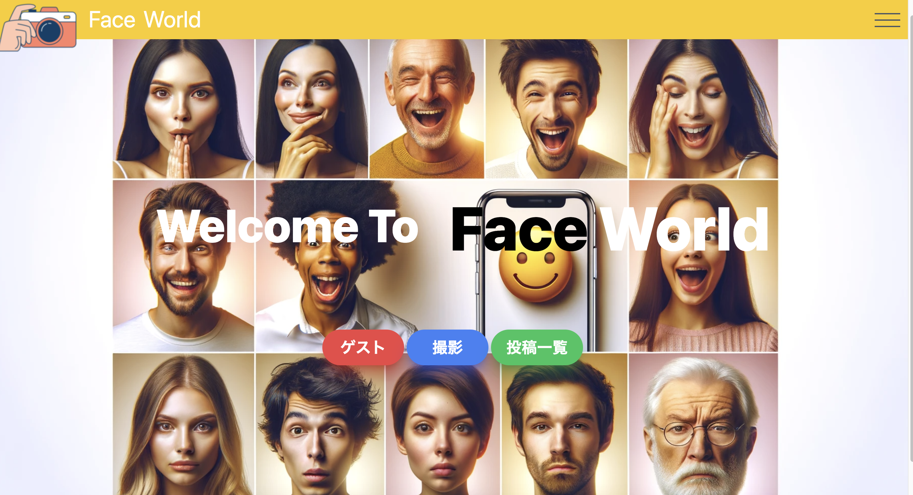
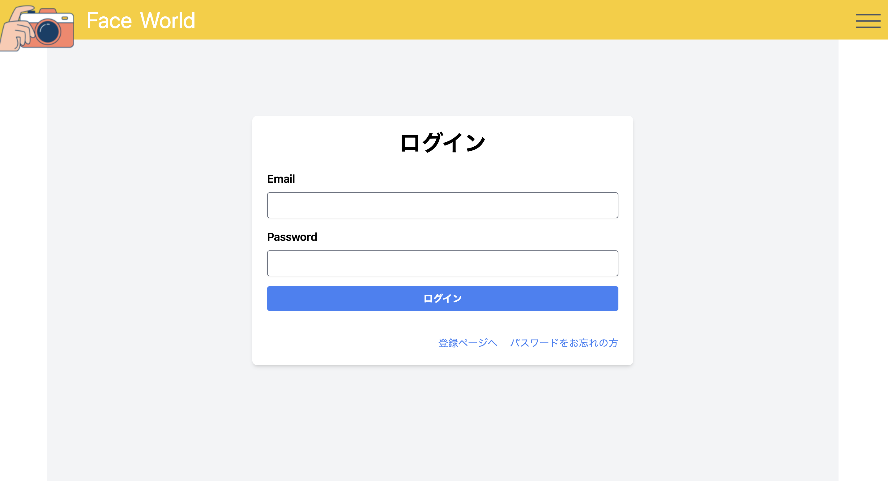
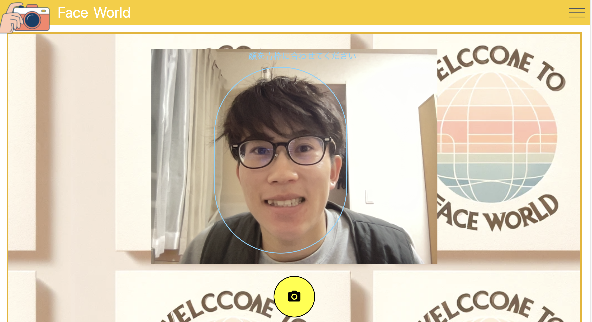
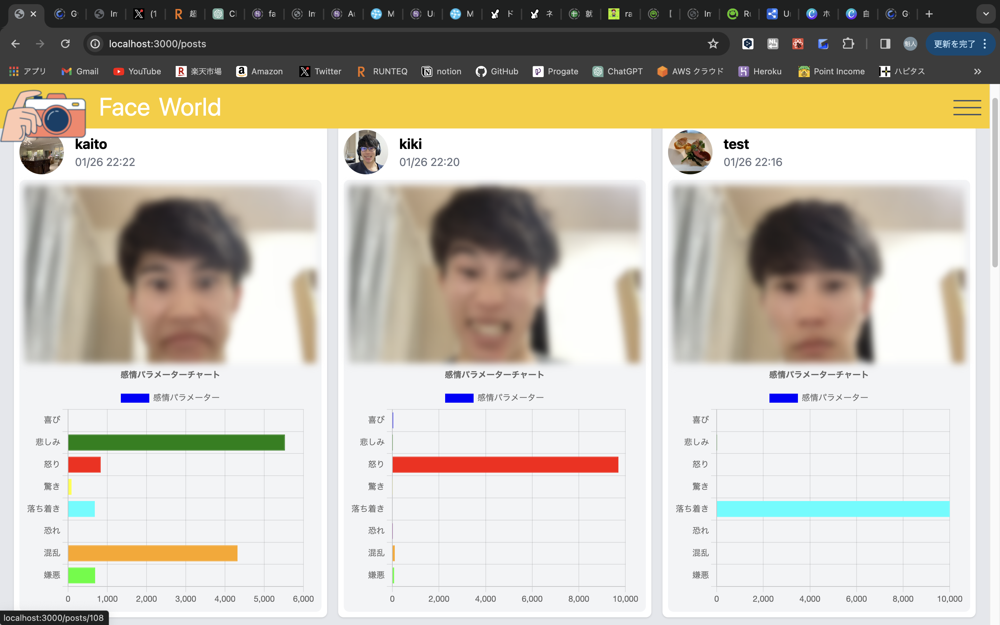

# Face World

 
[Figma](https://www.figma.com/file/8CS5ilDtB91CpvvoAxdnTm/improving_smile?type=design&node-id=0%3A1&mode=design&t=2Lil0QcGRa2ZQ86x-1)

[ER図](https://dbdiagram.io/d/65ab78eeac844320ae5436a2)
## サービスURL

ゲスト機能を実装しましたので、登録せずにお試しいただくこともできます。
https://www.face-world-app.com/

## アプリを作ったきっかけ

私が開発した「Face World」は、
ユーザーが自身の表情とそれが伝える感情を理解するためのWebアプリです。このアプリは、特に自分の表情が他人にどのような感情として伝わっているかについて疑問を持つ人々のニーズを満たすことを目指しています。このアプリのアイデアは、写真撮影のときなどに私自身が周囲から「もっと笑った方がいい」と言われるなど、自分の表情がどのような感情として他人に伝わっているのかについて疑問を感じたことから生まれました。特に、怒っているわけではないのに「怒ってる？」と聞かれた経験や、表情から誤解されることの多さに注目し、顔の表情を分析し感情を可視化するサービスを考案しました。

## アプリの特徴

ユーザーは自分の顔写真をアップロードするだけで、「喜び」「悲しみ」「怒り」などの感情要素を棒グラフで確認できます。この可視化を通じて、自分が認識していた表情が持つ感情と他人が受け取る感情のギャップに気づくことができます。これにより、ユーザーは自分の顔の表情についてより深く理解し、コミュニケーションの質を向上させることが可能です。さらに、笑顔判定機能や他ユーザーとの結果共有機能を通じて、コミュニケーションの幅を広げることができます。このアプリは、自己理解を深めると同時に、他者とのより良い関係構築を支援することを目的としたアプリとなっています。

## 機能一覧

| トップ画面 | ログイン画面 |
| ----------|----------|
||
|登録せずにサービスをお試しいただくためのゲスト機能を実装しました。|メールアドレスとパスワードでのログイン機能を実装しました。|

| カメラ画面 | 分析画面(上部)|
| ----------|----------|
| | .png) |
|撮影ボタンを押した後にはプレビューが表示され、再撮影も可能になるようにカメラ機能を実装しました。|口角の上がり具合をチェック機能やぼかし機能を実装しました。|

| 分析画面（下部）|　投稿一覧画面 |
| ----------|----------|
|.png)|
|感情をグラフ化して、笑顔判定機能や目線の向きなども機能に加えました。| 撮影した顔写真とグラフが見えるようにしました。また、ページネーション機能も実装しました。|

### MVP

- 会員登録
- ログイン
- 写真撮影機能
（画像のサイズを統一）⬜︎Reactで実装
- 写真分析機能（採点）
- 自分のレビューを投稿する機能
　（投稿の仕方に「ボカシ」を選べるようにする）⬜︎Tailwindcssで実装
- SNSへの投稿機能
- 会員登録時にステップ入力を導入
（1ページ目：メール、パスワード　2ページ目：名前、アイコン）⬜︎ステップ入力で実装
- ユーザーは過去の投稿を一覧で「マイスマイルヒストリー」としてマイページに保持
（採点時に用いた画像を縮小して掲載する）⬜︎ImageMagicを使用する。
- ユーザー同士のフォロー機能
- 投稿へのいいね機能
- 投稿へのコメント機能

### その後の機能

- 写真分析機能(提案)
 顔のランドマークを取得して、理想的な顔との差異を判定
- 初期画面で好きな笑顔の画像を選択→それに近づけるような提案
- 表情改善に関するコンテンツ の掲載
- OGP設定
- アバター設定時のプレビュー機能

#### 使用技術
##### フロントエンド
- React.js 
- Chart.js
- Tailwindcss
##### バックエンド
- Ruby (3.2.2)
- Ruby on Rails (7.0.8)
 #####インフラ/ストレージ
- heroku
- AWS S3
##### 顔認識
- aws-sdk-rekognition
